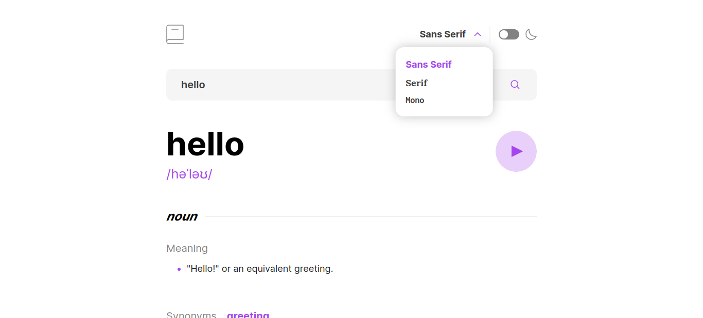
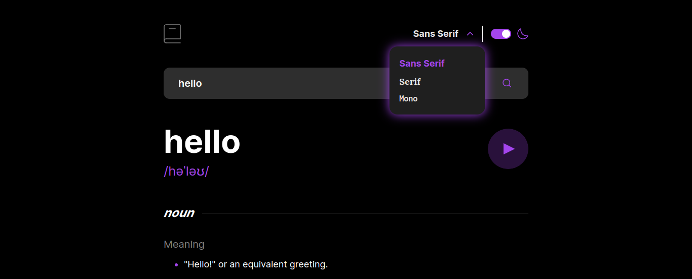

# Dictionary web app

## Table of contents

- [Overview](#overview)
  - [Functionalities](#functionalities)
  - [Screenshot](#screenshot)
  - [Links](#links)
- [My process](#my-process)
  - [Built with](#built-with)
  - [What I learned](#what-i-learned)

## Overview

### Functionalities

Users should be able to:

- Search for words using the input field
- See the Free Dictionary API's response for the searched word
- See a form validation message when trying to submit a blank form
- Play the audio file for a word when it's available
- Switch between serif, sans serif, and monospace fonts
- Switch between light and dark themes
- View the optimal layout for the interface depending on their device's screen size
- See hover and focus states for all interactive elements on the page

### Screenshot

#### Light mode

 

#### Dark mode

### Links

- Live Site URL: [Live Site](https://dictionary-web-app-eight-zeta.vercel.app/)

## My process

### Built with

- [React](https://react.dev/) 
- [Tailwind CSS](https://tailwindcss.com/)

### What I learned

The Free Dictionary API was very confusing and the API response was very scattered as there were multiple duplicate objects.

- I learnt how to use the filter method in javascript to filter the data from the API response.

- I learnt how to integrate audio

